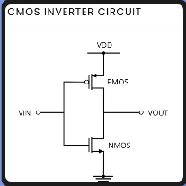
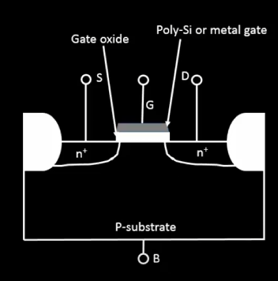
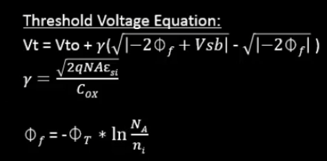
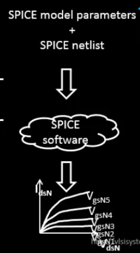
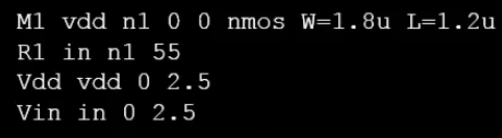
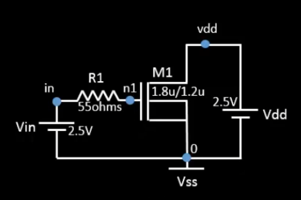
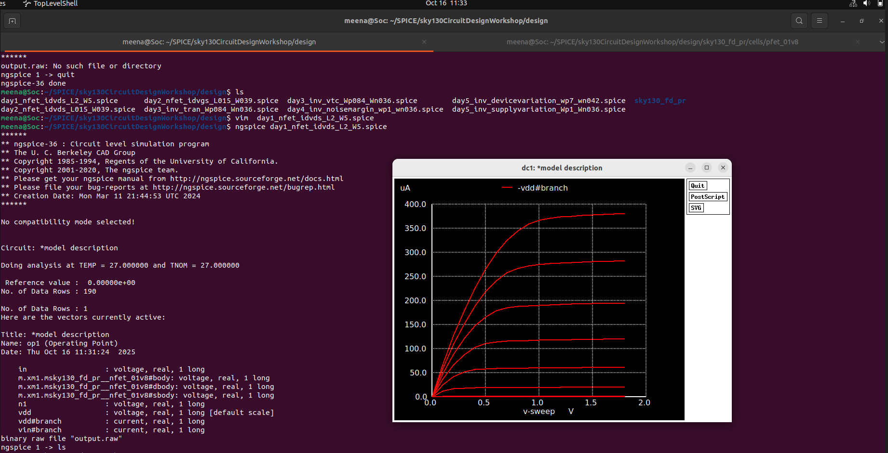

# Day-1: Basics of NMOS Drain (Id) Vs Drain-to-Source Voltage (Vds)

> Explore NMOS transistor behavior, CMOS circuit fundamentals, and SPICE simulations using the Sky130 technology node.

---

## 📘 INDEX
- [🧠 Theory](#-theory)
- [🧪 Lab](#-lab)

---

## 🧠 Theory

### 📑 Table of Contents
- [Overview](#overview)
- [Circuit Design Fundamentals](#circuit-design-fundamentals)
- [Role of SPICE in Circuit Design](#role-of-spice-in-circuit-design)
- [CMOS Inverter Working Principle](#cmos-inverter-working-principle)
- [Voltage Transfer Characteristics (VTC)](#voltage-transfer-characteristics-vtc)
- [Timing Characterization and Delay](#timing-characterization-and-delay)
- [Delay Lookup Table (LUT) Modeling](#delay-lookup-table-lut-modeling)
- [NMOS Transistor Physics](#nmos-transistor-physics)
- [Operating Regions of NMOS](#operating-regions-of-nmos)
- [Threshold Voltage & Body Effect](#threshold-voltage--body-effect)
- [Current Equations](#current-equations)
- [Drift Current Mechanism](#drift-current-mechanism)
- [Summary of Theory](#summary-of-theory)

---

### Overview
This workshop introduces CMOS transistor operation, SPICE simulation, and Sky130 device characterization.

You will learn:
- How NMOS transistors behave under varying Vgs & Vds  
- How to simulate transistor characteristics in SPICE  
- How delay and timing are characterized in real chips  

---

### Circuit Design Fundamentals
CMOS design depends on **NMOS and PMOS transistors** operating together to form logic gates.  
Understanding their electrical properties is the foundation for analyzing circuit behavior.

---

### Role of SPICE in Circuit Design
SPICE (Simulation Program with Integrated Circuit Emphasis) enables accurate modeling of circuit characteristics before fabrication.

| Function | Benefit |
|-----------|----------|
| Functional Verification | Checks logic correctness |
| Timing Analysis | Measures propagation delay |
| Power Estimation | Computes static and dynamic power |
| Design Optimization | Adjusts transistor sizing & topology |

---

### CMOS Inverter Working Principle

<p align="center">
  
  <br><em>Figure 1: CMOS Inverter Circuit</em>
</p>

**Working Table**

| Input | PMOS | NMOS | Output |
|-------|-------|-------|--------|
| LOW | ON | OFF | HIGH |
| HIGH | OFF | ON | LOW |

---

### Voltage Transfer Characteristics (VTC)
The inverter’s **VTC curve** shows how the output voltage changes with input, highlighting:
- **Switching threshold (Vm)**
- **Noise margins**
- **Transition region**

<p align="center">
  
  <br><em>Figure 2: Voltage Transfer Characteristics</em>
</p>

---

### Timing Characterization and Delay
Cell delay is extracted under various input transitions and load conditions to form timing models.

---

### Delay Lookup Table (LUT) Modeling
Delay data is stored in 2D LUTs based on **input slew** and **output load**.

<p align="center">
  
  <br><em>Figure 3: Delay Lookup Table Structure</em>
</p>

**Output Capacitance Formula**
```
C_total(G1) = C_out(G1) + Σ C_in(connected gates) + Σ C_wire
```

---

### NMOS Transistor Physics
NMOS operates by inducing an inversion layer when **Vgs > Vth**, allowing electrons to flow from source to drain.

<p align="center">
  
  <br><em>Figure 4: NMOS Structure</em>
</p>

---

### Operating Regions of NMOS

| Region | Condition | Behavior |
|--------|------------|-----------|
| Cutoff | V_GS < V_th | No conduction |
| Linear | V_GS > V_th, V_DS < V_GS − V_th | Acts as resistor |
| Saturation | V_GS > V_th, V_DS ≥ V_GS − V_th | Constant Id |

---

### Threshold Voltage & Body Effect

<p align="center">
  
</p>

```
Vth(VSB) = Vth0 + γ[√(2φF + VSB) − √(2φF)]
```
---

### Current Equations
**Linear Region**
```
Id = μnCox(W/L)[(Vgs − Vth)Vds − (Vds²/2)]
```

**Saturation Region**
```
Idsat = (μnCoxW/2L)(Vgs − Vth)²(1 + λVds)
```

---

### Drift Current Mechanism
```
v_drift = μn × E_field
Id = Qi(x) × v(x) × W
```

---

### Summary of Theory
The theory section forms the foundation for the SPICE-based lab, explaining transistor operation, delay modeling, and circuit design fundamentals.

---

## 🧪 Lab

### 📑 Table of Contents
- [Overview of Simulation Flow](#overview-of-simulation-flow)
- [SPICE Netlist Syntax](#spice-netlist-syntax)
- [NMOS Characterization Circuit](#nmos-characterization-circuit)
- [Simulation and Output Generation](#simulation-and-output-generation)
- [Extracted NMOS Parameters](#extracted-nmos-parameters)

---

### Overview of Simulation Flow
SPICE simulations allow designers to analyze transistor-level circuits before fabrication.  
The design flow includes:
1. Writing the SPICE netlist  
2. Running simulation in Ngspice  
3. Generating waveform and data outputs  

<p align="center">
  
  <br><em>Figure 5: VLSI Design Simulation Flow</em>
</p>

---

### SPICE Netlist Syntax

```spice
M<n> <drain> <gate> <source> <bulk> <model> W=<width> L=<length>
<p align="center">  </p>
NMOS Characterization Circuit
<p align="center">  </p>
spice
Copy code
* NMOS I-V Characteristics
.param temp=27
.lib "sky130_fd_pr/models/sky130.lib.spice" tt
XM1 Vdd n1 0 0 sky130_fd_pr__nfet_01v8 w=5 l=2
R1 n1 in 55
Vdd vdd 0 1.8V
Vin in 0 1.8V
.dc Vdd 0 1.8 0.1 Vin 0 1.8 0.2
.end
```

### Simulation and Output Generation
```
ngspice day1_nfet_idvds_L2_W5.spice
plot -vdd#branch
wrdata output.csv -vdd#branch
```
<p align="center">  <br><em>Figure 6: NMOS I-V Output Curves</em> </p>
**Extracted NMOS Parameters**

| **Parameter**        | **Symbol** | **Value** | **Unit** |
|----------------------|------------|------------|----------|
| Threshold Voltage     | Vth        | 0.48       | V        |
| Saturation Current    | Idsat      | 282.6      | µA       |
| Channel Modulation    | λ          | 0.034      | V⁻¹      |
| Early Voltage         | VA         | 29.4       | V        |


## 🧾 Final Summary – Day 1: CMOS Inverter Design

On **Day 1**, the focus was on exploring the **fundamentals of CMOS inverter operation** at the transistor level using the **Sky130 PDK** and **Ngspice** simulation tools.  
The session covered both the *theoretical understanding* and *practical implementation* aspects of inverter behavior.

### 🔍 Key Learnings
- Understood the **complementary action** of PMOS and NMOS in inverter logic.  
- Analyzed **static and dynamic characteristics** of the CMOS inverter.  
- Observed the **Voltage Transfer Characteristic (VTC)** curve and determined the **switching threshold**.  
- Evaluated **noise margins**, **power dissipation**, and **inverter symmetry**.  
- Verified inverter performance through **Ngspice transient and DC simulations**.

### 📈 Results
- The inverter exhibited a **sharp transition** near mid-supply voltage (≈ VDD/2).  
- Measured **noise margins** were within expected CMOS limits, confirming design stability.  
- Simulated **waveforms and plots** matched theoretical predictions.  

### 🧠 Insights
- **CMOS technology** ensures low static power and high noise immunity.  
- **Transistor sizing (Wp/Wn ratio)** directly affects switching speed and output balance.  
- **Process variation** can cause slight shifts in threshold voltage but maintains logical integrity.

---