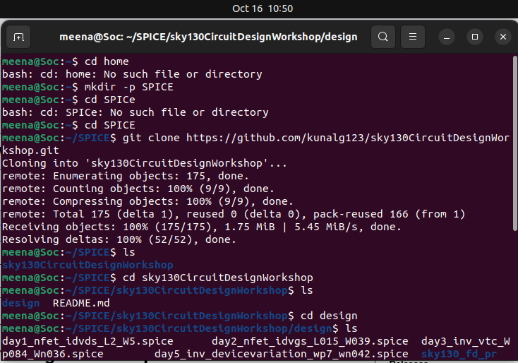
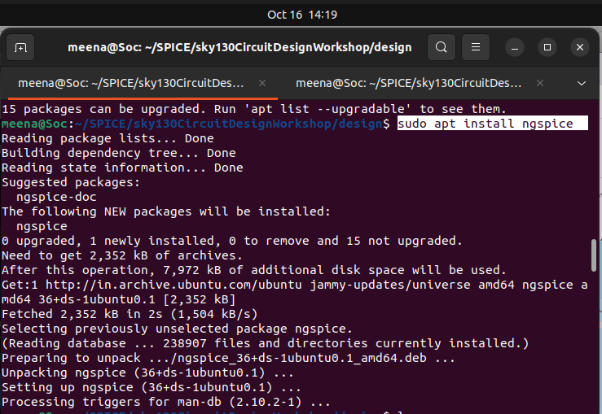

# Day-1 Basics of NMOS Drain(id) Vs Drain-to-source Voltage(Vds)

> A comprehensive guide to understanding CMOS transistor behavior, circuit analysis, and practical SPICE simulation using Sky130 technology.

---

## 📋 Table of Contents

- [Overview](#overview)
- [Module 1: Circuit Design Fundamentals](#module-1-circuit-design-fundamentals)
- [Module 2: NMOS Transistor Physics](#module-2-nmos-transistor-physics)
- [Module 3: Hands-on SPICE Simulation](#module-3-hands-on-spice-simulation)
- [Getting Started](#getting-started)


---

## Overview

This workshop provides an in-depth exploration of CMOS circuit design through theoretical concepts and practical SPICE simulations. You'll learn to model, simulate, and analyze transistor-level circuits using industry-standard tools and the open-source Sky130 PDK.

**What You'll Learn:**
- Transistor operation principles and I-V characteristics
- Circuit simulation methodology using SPICE
- Timing analysis and delay characterization
- Real-world circuit design using Sky130 technology models

---

## Module 1: Circuit Design Fundamentals

### The Role of SPICE in Modern Circuit Design

SPICE (Simulation Program with Integrated Circuit Emphasis) serves as the backbone of pre-silicon verification, enabling designers to validate circuit behavior without costly fabrication runs.

#### Key Capabilities

| Purpose | Benefit |
|---------|---------|
| **Functional Verification** | Validate logic correctness before tape-out |
| **Performance Analysis** | Measure propagation delays and signal integrity |
| **Power Estimation** | Calculate static and dynamic power consumption |
| **Design Optimization** | Iterate rapidly on transistor sizing and topology |

#### Practical Example: CMOS Inverter Analysis

The CMOS inverter represents the fundamental building block of digital circuits. Its operation demonstrates complementary transistor behavior:

<p align="center">
  
  <br>
  <em>Figure 1: CMOS Inverter Circuit Diagram</em>
</p>

**Circuit Topology:**
- PMOS transistor connected between VDD and output node
- NMOS transistor connected between output node and ground
- Both gates tied to the input signal
- Load capacitance (CL) models downstream circuit loading

**Switching Behavior:**

| Input State | PMOS | NMOS | Output | Current Path |
|-------------|------|------|--------|--------------|
| LOW (0V) | Conducting | Cut-off | HIGH (VDD) | VDD → PMOS → Output |
| HIGH (VDD) | Cut-off | Conducting | LOW (0V) | Output → NMOS → GND |

#### Simulation Outputs

SPICE generates two critical characteristics:

<p align="center">
  
  <br>
  <em>Figure 2: CMOS Inverter I-V and VTC Characteristics</em>
</p>

1. **Current-Voltage (I-V) Curves**: Shows drain current vs. output voltage across different input conditions
2. **Voltage Transfer Characteristic (VTC)**: Maps input voltage to output voltage, revealing noise margins and switching threshold

---

### Understanding Timing Characterization

Cell delays are not constant—they depend on environmental factors that must be accurately modeled.

#### Delay Lookup Tables (LUTs)

Modern timing libraries use 2D lookup tables indexed by:
- **Input Slew**: Transition time of the input signal edge
- **Output Load**: Capacitive loading at the output pin

<p align="center">
  
  <br>
  <em>Figure 3: Delay Lookup Table Organization</em>
</p>

#### Calculating Total Output Capacitance

When a gate drives multiple fanouts, compute total capacitance as:

**C_total = C_pin_output + Σ(C_pin_input_fanouts) + Σ(C_wire_segments)**

**Practical Scenario:**

For gate G1 driving gates G2, G3, and G4 through an interconnect network:

```
C_total(G1) = C_out(G1) + C_in(G2) + C_in(G3) + C_in(G4) 
              + C_wire1 + C_wire2 + C_wire3 + C_wire4
```
---

## Module 2: NMOS Transistor Physics

### Transistor Structure and Operation

An NMOS transistor consists of four terminals:
- **Gate (G)**: Control terminal
- **Drain (D)**: Current output
- **Source (S)**: Current input
- **Bulk/Body (B)**: Substrate connection

<p align="center">
  
  <br>
  <em>Figure 6: NMOS Transistor Physical Structure</em>
</p>

#### Operating Regions

>V_GS - Gate Voltage  
>V_th - Threshold Voltage

**What is Surface Inversion ?**
- Surface inversion means the surface of the p-type substrate gets inverted to n-type due to a strong positive gate voltage.

**Cut-off (`V_GS` < `V_th`):**
- No inversion channel exists
- Drain current ≈ 0 (only leakage)
- Transistor acts as open switch

**Triode/Linear (`V_GS` > `V_th`, `V_DS` < `V_GS` - `V_th`):**
- Continuous channel from source to drain
- Current proportional to (V_GS - V_th)·V_DS
- Transistor behaves as voltage-controlled resistor

**Saturation (`V_GS` > `V_th`, `V_DS` ≥ `V_GS` - `V_th`):**
- Channel pinched off near drain
- Current relatively independent of V_DS
- Current proportional to (V_GS - V_th)²

**Modified Threshold Voltage:**

<p align="center">
  
</p>

```
V_th(V_SB) = V_th0 + γ × [√(|2φ_F| + V_SB) - √(|2φ_F|)]
```

Where:
- **γ**: Body effect coefficient (provided by foundry)
- **φ_F**: Fermi potential (material constant)
- **V_th0**: Zero-bias threshold voltage

**Physical Explanation:**
- Reverse bias widens depletion region
- Requires stronger gate voltage to achieve inversion
- Affects stacked transistors in logic gates

### Current Equations

#### Cutoff Region Model

```
When V_GS < V_th:
├── Gate voltage insufficient to bend energy bands
├── No inversion layer forms at Si-SiO2 interface
├── Only reverse-biased p-n junction (substrate-drain)
└── Current limited to leakage (~pA to nA range)
```

#### Linear Region Model

```
When V_GS > V_th and V_DS small:
├── Strong inversion channel exists
├── Channel depth uniform from source to drain
├── Voltage drop distributed across channel length
└── Current follows drift-diffusion transport

I_D = µ_n × C_ox × (W/L) × [(V_GS - V_th)×V_DS - V_DS²/2]
     ↑       ↑       ↑              ↑
  mobility oxide  geometry    voltage terms
```

#### Saturation Region Model

```
When V_DS ≥ V_GS - V_th:
├── Channel voltage at drain = V_GS - V_th
├── Charge density → 0 at drain (pinch-off point)
├── Channel "pinches off" near drain
└── Further V_DS increase doesn't affect channel charge

I_Dsat = (µ_n × C_ox × W)/(2L) × (V_GS - V_th)² × (1 + λ×V_DS)
         ↑___________________________↑              ↑
         drive strength term                     CLM correction
```

Where:(Fixed Constants)
- **μ_n**: Electron mobility
- **C_ox**: Gate oxide capacitance per unit area
- **W/L**: Width-to-length ratio
- **λ**: Channel length modulation parameter

### Drift Current Mechanism

Current flow results from electric field-induced carrier drift:

**Drift Velocity:**
```
v_drift = μ_n × E_field
```

**Total Drain Current:**
```
I_D = (Charge density) × (Drift velocity) × (Channel width)
I_D = Q_i(x) × v(x) × W
```

This forms the foundation for deriving transistor current equations from first principles.

---

## Module 3: Hands-on SPICE Simulation

### Simulation Hierarchy

VLSI design tools operate at multiple abstraction levels:

<p align="center">
  
  <br>
  <em>Figure 12: VLSI Design Simulation Hierarchy</em>
</p>

| Level | Tool Examples | Purpose |
|-------|---------------|---------|
| **Process** | SUPREME, TCAD | Model fabrication effects on devices |
| **Circuit** | SPICE, Spectre, HSPICE | Analyze transistor-level behavior |
| **Logic** | VCS, ModelSim, Questa | Verify HDL functionality |
| **Architecture** | Gem5, SystemC | Evaluate system performance |

### SPICE Analysis Types

| Analysis | Command | Use Case |
|----------|---------|----------|
| **DC Operating Point** | `.op` | Find steady-state voltages/currents |
| **DC Sweep** | `.dc` | Generate I-V characteristics |
| **Transient** | `.tran` | Time-domain waveform analysis |
| **AC** | `.ac` | Frequency response analysis |
| **Noise** | `.noise` | Device noise characterization |

### SPICE Netlist Syntax

#### Component Declaration

**MOSFET:**
```spice
M<n> <drain> <gate> <source> <bulk> <model> W=<width> L=<length>
```

**Resistor:**
```spice
R<n> <node1> <node2> <resistance>
```

**Voltage Source:**
```spice
V<n> <positive_node> <negative_node> <DC_value>
```

<p align="center">
  
  <br>
  <em>Figure 13: Spice Netlist Syntax Example
  </em>
</p>

#### Example: NMOS Characterization Circuit

<p align="center">
  
  <br>
  <em>Figure 13: NMOS Characterization Test Circuit</em>
</p>

```spice
*Model Description
.param temp=27
*Including sky130 library files
.lib "sky130_fd_pr/models/sky130.lib.spice" tt
*Netlist Description
XM1 Vdd n1 0 0 sky130_fd_pr__nfet_01v8 w=5 l=2
R1 n1 in 55
Vdd vdd 0 1.8V
Vin in 0 1.8V
*simulation commands
.op
.dc Vdd 0 1.8 0.1 Vin 0 1.8 0.2
.control
run
display
setplot dc1
.endc
.end
```

**Netlist Breakdown:**

| Line | Component | Description |
|------|-----------|-------------|
| `M1 vdd n1 0 0 ...` | NMOS transistor | Drain=vdd, Gate=n1, Source=GND, Bulk=GND |
| `R1 in n1 55` | Gate resistor | 55Ω between input and gate (limits current) |
| `Vdd vdd 0 2.5` | Supply voltage | 2.5V DC source |
| `Vin in 0 2.5` | Gate voltage | Sweeps gate bias |
| `.dc Vdd 0 2.5 0.01` | DC sweep | V_DS sweep with 10mV steps |

---

## Getting Started

### Prerequisites

- Basic understanding of semiconductor physics
- Familiarity with circuit theory
- Linux-based operating system (recommended)

### Installation

**Clone the workshop repository:**

```bash
mkdir -p SPICE
git clone https://github.com/kunalg123/sky130CircuitDesignWorkshop.git
cd sky130CircuitDesignWorkshop
```

<p align="center">
  
  <br>
  <em>Figure 13: Git Clone
  </em>
</p>

### Structure
```
SPICE/
│
└── sky130CircuitDesignWorkshop/
    └── design/
        ├── day1_nfet_idvds_L2_W5.spice
        ├── day2_nfet_idvgs_L015_W039.spice
        ├── day2_nfet_idvds_L015_W039.spice
        ├── day3_inv_vtc_Wp084_Wn036.spice
        ├── day3_inv_tran_Wp084_Wn036.spice
        ├── day4_inv_noisemargin_wp1_wn036.spice
        ├── day5_inv_supplyvariation_Wp1_Wn036.spice
        ├── day5_inv_devicevariation_wp7_wn042.spice
        │
        └── sky130_fd_pr/
            ├── models/
            │   ├── all.spice
            │   └── sky130.lib.spice
            │
            └── cells/
                ├── nfet_01v8/
                │   ├── sky130_fd_prnfet_01v8.pm3.spice
                │   ├── sky130_fd_prnfet_01v8__tt.pm3.spice
                │   ├── sky130_fd_prnfet_01v8ff.corner.spice
                │   ├── sky130_fd_prnfet_01v8ff.pm3.spice
                │   ├── sky130_fd_prnfet_01v8fs.corner.spice
                │   ├── sky130_fd_prnfet_01v8fs.pm3.spice
                │   ├── sky130_fd_prnfet_01v8sf.corner.spice
                │   ├── sky130_fd_prnfet_01v8sf.pm3.spice
                │   ├── sky130_fd_prnfet_01v8ss.corner.spice
                │   ├── sky130_fd_prnfet_01v8ss.pm3.spice
                │   ├── sky130_fd_prnfet_01v8tt.corner.spice
                │   └── sky130_fd_prnfet_01v8mismatch.corner.spice
                │
                └── pfet_01v8/
                    ├── sky130_fd_prpfet_01v8.pm3.spice
                    ├── sky130_fd_prpfet_01v8__ss.pm3.spice
                    ├── sky130_fd_prpfet_01v8ff.corner.spice
                    ├── sky130_fd_prpfet_01v8ff.pm3.spice
                    ├── sky130_fd_prpfet_01v8fs.corner.spice
                    ├── sky130_fd_prpfet_01v8fs.pm3.spice
                    ├── sky130_fd_prpfet_01v8sf.corner.spice
                    ├── sky130_fd_prpfet_01v8sf.pm3.spice
                    ├── sky130_fd_prpfet_01v8ss.corner.spice
                    ├── sky130_fd_prpfet_01v8tt.corner.spice
                    ├── sky130_fd_prpfet_01v8tt.pm3.spice
                    ├── sky130_fd_prpfet_01v8tt_discrete.corner.spice
                    └── sky130_fd_prpfet_01v8mismatch.corner.spice
```

**Install ngspice (open-source SPICE simulator):**

```bash
# Ubuntu/Debian
sudo apt-get update
sudo apt-get install ngspice
```

<p align="center">
  
  <br>
  <em>Figure 13: NGSPICE Installation
  </em>
</p>

### Running Your First Simulation

**Execute a SPICE netlist:**

```bash
ngspice day1_nfet_idvds_L2_W5.spice 
```

**Generate plots:**

```spice
ngspice 1 -> plot -vdd#branch
```

**Save waveform data:**

```spice
ngspice 3 -> write output.raw  #if you wish to generate binary format
ngspice 4 ->wrdata output.csv -vdd#branch  #generates csv files
ngspice 5 -> quit
$less output.csv   #view the csv file
```


### Example Simulation: NMOS I-V Curves

**Netlist (day1_nfet_idvds_L2_W5.spice):**

```spice
*** NMOS DC Characteristic - Sky130 ***

.param temp=27

.lib "models/sky130_fd_pr/sky130.lib.spice" tt

*** Device Under Test ***
XM1 vdd n1 0 0 sky130_fd_pr__nfet_01v8 w=5 l=2
R1 n1 in 55

*** Voltage Sources ***
Vdd vdd 0 1.8
Vin in 0 1.8

*** Sweep V_DS for multiple V_GS values ***
.dc Vdd 0 1.8 0.1 Vin 0 1.8 0.2

.control
run
display
setplot dc1
plot -vdd#branch
.endc

.end
```

**Output:**

<p align="center">
  
  <br>
  <em>Figure 14: Simulated NMOS I-V Characteristics (W=5µm, L=2µm, Sky130)</em>
</p>

- Family of I_D vs V_DS curves
- Each curve represents different V_GS value
- Clearly shows linear and saturation regions

---

## Extracted NMOS DC Parameters (output.csv)

| Parameter | Symbol | Extracted Value | Unit | Extraction Method |
|-----------|--------|----------------|------|-------------------|
| **Threshold Voltage (estimated)** | V_th | ~0.45-0.50 | V | Extrapolation from V_GS where I_D is significant |
| **Saturation Current (V_GS=0.6V)** | I_Dsat | 194.8 | µA | I_D at V_DS = 1.8V |
| **Saturation Current (V_GS=0.8V)** | I_Dsat | 282.6 | µA | I_D at V_DS = 1.8V |
| **Saturation Current (V_GS=1.0V)** | I_Dsat | 380.7 | µA | I_D at V_DS = 1.8V |
| **Linear Region R_on (V_GS=0.8V)** | R_on | 1,721 | Ω | V_DS/I_D at V_DS = 0.1V |
| **Linear Region R_on (V_GS=1.0V)** | R_on | 1,491 | Ω | V_DS/I_D at V_DS = 0.1V |
| **Channel Length Modulation** | λ | 0.034 | V⁻¹ | Slope in saturation |
| **Early Voltage** | V_A | 29.4 | V | 1/λ |
| **Output Conductance (V_GS=0.8V)** | g_ds | 6-9 | µS | ΔI_D/ΔV_DS in saturation |

## Resources

### Technology Files

**Sky130 Model Locations:**

1. **NMOS Model (Typical Corner):**
   ```
   models/sky130_fd_pr/cells/nfet_01v8/sky130_fd_pr__nfet_01v8__tt.pm3.spice
   ```

2. **Process Corner Models:**
   ```
   models/sky130_fd_pr/cells/nfet_01v8/sky130_fd_pr__nfet_01v8__tt.corner.spice
   ```

3. **Complete Model Library:**
   ```
   models/sky130_fd_pr/models/sky130.lib.spice
   ```

### Key Parameters in Sky130 Models

| Parameter | Symbol | Typical Value | Description |
|-----------|--------|---------------|-------------|
| Threshold Voltage | V_th | ~0.45V | Gate voltage for strong inversion |
| Oxide Capacitance | C_ox | ~6.9 fF/µm² | Gate oxide cap per unit area |
| Electron Mobility | μ_n | ~400 cm²/V·s | Carrier mobility |
| Body Effect Coeff. | γ | ~0.45 V^0.5 | Substrate bias sensitivity |

### Further Learning

- **SPICE Documentation**: [Ngspice Manual](http://ngspice.sourceforge.net/docs/ngspice-manual.pdf)
- **Sky130 PDK**: [SkyWater PDK Documentation](https://skywater-pdk.readthedocs.io/)
- **VLSI Design**: *CMOS VLSI Design* by Weste and Harris
- **Original Workshop**: [VSD Hardware Design Program](https://github.com/kunalg123/sky130CircuitDesignWorkshop)

---
