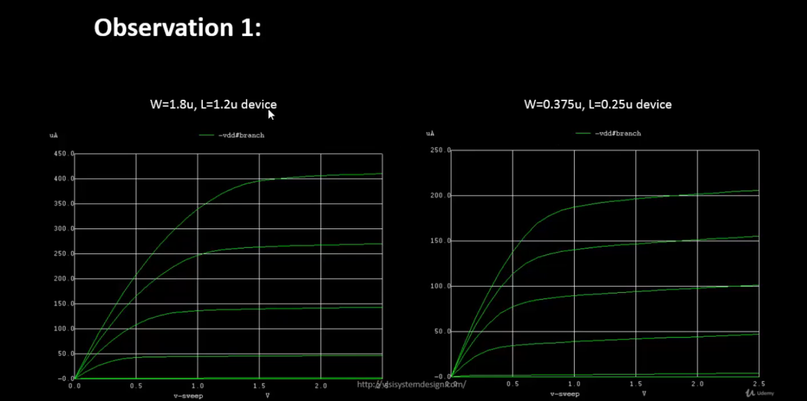
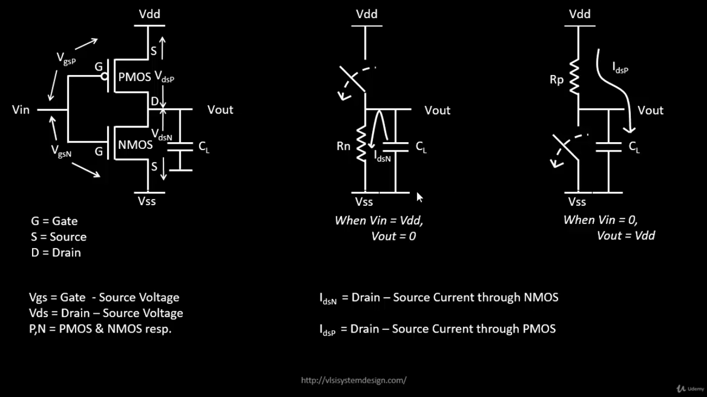

# Day-2: Velocity Saturation and CMOS Inverter VTC

Explore velocity saturation effects in short-channel devices, NMOS characteristics across technology nodes, and CMOS voltage transfer characteristics using Sky130 technology.

---

## 📘 INDEX

- 🧠 **Theory**
- 🧪 **Lab**

---

## 🧠 Theory

### 📑 Table of Contents

1. [Overview](#overview)
2. [SPICE Simulation for Lower Nodes](#spice-simulation-for-lower-nodes)
3. [Long Channel vs. Short Channel NMOS](#long-channel-vs-short-channel-nmos)
4. [Velocity Saturation Effects](#velocity-saturation-effects)
5. [Peak Current Comparison](#peak-current-comparison)
6. [CMOS Voltage Transfer Characteristics](#cmos-voltage-transfer-characteristics)
7. [CMOS Inverter Operation](#cmos-inverter-operation)
8. [Load Line Analysis](#load-line-analysis)
9. [Summary of Theory](#summary-of-theory)

---

### Overview

This session explores the transition from long-channel to short-channel MOSFET behavior, introducing the critical phenomenon of **velocity saturation** that fundamentally changes device characteristics in modern sub-micron technologies.

You will learn:

- How velocity saturation affects Id-Vgs characteristics in short-channel devices
- Differences between long-channel (>250nm) and short-channel (<250nm) transistors
- CMOS inverter switching behavior and voltage transfer characteristics
- Load line construction and graphical analysis techniques

---

### SPICE Simulation for Lower Nodes

The output characteristics of an NMOS device with **W=1.8µm, L=1.2µm (W/L = 1.5)** demonstrate classical MOSFET behavior:

<p align="center">
  
</p>

#### Operating Regions

| Region | Condition | Behavior |
|--------|-----------|----------|
| **Linear** | V_DS < (V_GS - V_th) | Id varies linearly with V_DS |
| **Saturation** | V_DS ≥ (V_GS - V_th) | Id influenced by channel length modulation |

**Key Observation:**
- Before V_DS = V_GS - V_th → Linear Region (ohmic behavior)
- After V_DS = V_GS - V_th → Saturation Region (current flattens)

---

### Long Channel vs. Short Channel NMOS

#### **Observation 1: Id-Vgs Characteristics**

Comparing two devices with **identical W/L ratios** but different absolute dimensions:

| Device Type | W | L | Classification |
|-------------|---|---|----------------|
| Long Channel | 1.8 µm | 1.2 µm | L > 250 nm |
| Short Channel | 0.375 µm | 0.25 µm | L < 250 nm |

<p align="center">
  
</p>

**Electrical Behavior Under Constant V_DS:**

**Long-Channel Devices:**
- Drain current (Id) exhibits ideal **quadratic dependence** on V_GS
- Classical square-law behavior: Id ∝ (V_GS - V_th)²

**Short-Channel Devices:**
- Id is quadratic at **low V_GS**
- Transitions to **linear relationship** at high V_GS
- Caused by **velocity saturation** limiting carrier velocity

<p align="center">
  
</p>

---

### Velocity Saturation Effects

#### Physical Mechanism

**At Low Electric Fields:**
- Carrier velocity increases linearly with electric field
- v_drift = µ × E

**At High Electric Fields:**
- Carrier velocity saturates at maximum value (v_sat ≈ 10⁷ cm/s for Si)
- Further increase in E does not increase velocity
- Results in linear Id-Vgs relationship instead of quadratic

<p align="center">
  
</p>

#### Impact on Operating Modes

**Long Channel Devices (> 250 nm):**
```
Cutoff → Resistive → Saturation
```

**Short Channel Devices (< 250 nm):**
```
Cutoff → Resistive → Velocity Saturation → Saturation
```

An **additional velocity saturation mode** appears between resistive and saturation regions in short-channel devices.

<p align="center">
  
</p>

---

### Peak Current Comparison

#### **Observation 2: Maximum Drain Current**

| Device | W | L | Peak Id |
|--------|---|---|---------|
| Long Channel | 1.8 µm | 1.2 µm | **410 µA** |
| Short Channel | 0.375 µm | 0.25 µm | **210 µA** |

<p align="center">
  
</p>

**Key Insight:**

Despite enabling faster switching and higher integration density, **short-channel devices deliver lower peak current** compared to long-channel devices.

**Reason:** Velocity saturation limits carrier velocity in short channels, preventing the current from reaching theoretical maximums based on geometry alone.

- Long-channel: Carriers accelerate freely → Higher Id
- Short-channel: Velocity capped by saturation → Lower Id

---

### CMOS Voltage Transfer Characteristics

#### MOSFET as a Switch

**OFF State (Open Switch):**
- Condition: |V_GS| < |V_th|
- Resistance: Infinite (no conduction)

**ON State (Closed Switch):**
- Condition: |V_GS| > |V_th|
- Resistance: Finite R_on

---

### CMOS Inverter Operation

#### Transistor-Level and Switch-Level View

**Circuit Configuration:**
- PMOS connected to V_DD (pull-up network)
- NMOS connected to V_SS/GND (pull-down network)
- Input (V_in) drives both gates
- Output (V_out) taken from common drain node
- Load capacitance (C_L) at output

<p align="center">
  
</p>

#### Operating States

**When V_in = V_DD (Logic HIGH):**
- NMOS: ON (acts as resistor R_n)
- PMOS: OFF (open switch)
- **Result:** V_out = 0 (Logic LOW)

**When V_in = 0 (Logic LOW):**
- PMOS: ON (acts as resistor R_p)
- NMOS: OFF (open switch)
- **Result:** V_out = V_DD (Logic HIGH)

**Design Principle:**

This complementary operation ensures:
- **Low static power** (no DC path from V_DD to GND in steady state)
- **Sharp transitions** in voltage transfer characteristics
- Foundation of all CMOS logic circuits

---

### Load Line Analysis

#### Step-by-Step Construction

**Step 1: Voltage Conversion**
- Convert PMOS gate-source voltage (V_GSP) into equivalent V_in
- Express all node voltages in terms of: V_in, V_DD, V_SS, V_out

<p align="center">
  
</p>

**Step 2 & 3: Drain-Source Mapping**
- Convert both PMOS and NMOS drain-source voltages to V_out
- NMOS: V_DS = V_out
- PMOS: V_SD = V_DD - V_out

<p align="center">
  
</p>

**Step 4: Merge Load Curves**
- Equate NMOS and PMOS I_ds characteristics
- At DC equilibrium: I_DS(NMOS) = I_DS(PMOS)
- Sweep V_in from 0 to V_DD
- Plot corresponding V_out to generate VTC curve

**Result:** The Voltage Transfer Characteristic (VTC) shows the inverter's switching behavior from logic HIGH to LOW, revealing:
- Switching threshold (V_M)
- Noise margins (NM_L, NM_H)
- Transition region width
- Gain in transition region

<p align="center">
  
</p>

---

### Summary of Theory

Day-2 theory focuses on the physical limitations that emerge as MOSFET dimensions shrink below 250nm. **Velocity saturation** fundamentally alters device behavior, requiring careful consideration in circuit design. Understanding these effects, combined with load line analysis and VTC characterization, provides the foundation for designing robust CMOS circuits in modern technology nodes.

---

## 🧪 Lab

### 📑 Table of Contents

1. [Overview of Sky130 Characterization](#overview-of-sky130-characterization)
2. [NMOS Id-Vds Simulation](#nmos-id-vds-simulation)
3. [NMOS Id-Vgs Simulation](#nmos-id-vgs-simulation)
4. [Waveform Analysis](#waveform-analysis)

---

### Overview of Sky130 Characterization

In this lab, we characterize NMOS transistors from the **Sky130 PDK** to observe:
- Output characteristics (Id vs V_DS)
- Transfer characteristics (Id vs V_GS)
- Impact of device dimensions on current behavior

**Tools Used:**
- Ngspice for SPICE simulation
- Sky130 process models

---

### NMOS Id-Vds Simulation

#### Circuit: `day2_nfet_idvds_L015_W039.spice`

This simulation sweeps V_DS while holding V_GS constant at multiple values.

**Running the Simulation:**

```bash
ngspice day2_nfet_idvds_L015_W039.spice
```

**Plotting the Output:**

```ngspice
plot -vdd#branch
```

<p align="center">
  
</p>

**Expected Results:**
- Family of curves showing Id vs V_DS for different V_GS values
- Clear demarcation between linear and saturation regions
- Observation of channel length modulation effects

---

### NMOS Id-Vgs Simulation

#### Circuit: `day2_nfet_idvgs_L015_W039.spice`

This simulation sweeps V_GS while holding V_DS constant.

**Running the Simulation:**

```bash
ngspice day2_nfet_idvgs_L015_W039.spice
```

**Plotting the Output:**

```ngspice
plot -vdd#branch
```

<p align="center">
  
</p>

**Expected Results:**
- Transfer characteristic showing Id vs V_GS
- Subthreshold region (weak inversion)
- Strong inversion region with velocity saturation effects
- Extraction of threshold voltage (V_th)

---

### Waveform Analysis

#### Key Parameters to Extract

| Parameter | Description | Typical Value |
|-----------|-------------|---------------|
| V_th | Threshold Voltage | ~0.4-0.5 V |
| I_dsat | Saturation Current | Device-dependent |
| g_m | Transconductance | ∂Id/∂V_GS |
| λ | Channel Modulation | From saturation slope |

**Analysis Steps:**
1. Identify linear vs. saturation regions in Id-Vds plot
2. Extract V_th from Id-Vgs characteristic
3. Compare behavior with theoretical equations
4. Note deviations due to velocity saturation

---

## 🧾 Final Summary – Day 2: Velocity Saturation and VTC

On Day 2, the focus shifted to understanding short-channel effects and their impact on MOSFET behavior, particularly **velocity saturation** and its implications for circuit design using Sky130 technology.

### 🔍 Key Learnings

- Understood the fundamental difference between long-channel and short-channel MOSFET behavior
- Analyzed how velocity saturation changes Id-Vgs from quadratic to linear relationship
- Observed reduced peak current in short-channel devices despite smaller geometries
- Constructed and interpreted CMOS inverter load line curves
- Generated voltage transfer characteristics through graphical DC analysis
- Simulated Sky130 NMOS devices and extracted key electrical parameters

### 📈 Results

- Short-channel devices exhibit velocity saturation at high gate voltages
- Peak current is lower in short-channel devices compared to long-channel devices with same W/L ratio
- VTC curves demonstrate sharp CMOS inverter switching characteristics
- Simulation results align with theoretical predictions of velocity saturation effects

### 🧠 Insights

- **Velocity saturation** is unavoidable in modern sub-250nm technologies and must be accounted for in circuit design
- Short-channel effects introduce an additional operating mode between resistive and saturation regions
- Despite lower peak currents, short-channel devices enable higher speed operation due to reduced capacitances
- Load line analysis provides intuitive graphical understanding of inverter DC operating points
- Sky130 PDK enables accurate modeling of real-world device behavior including second-order effects

---

**Next Steps:** Day 3 will explore dynamic switching characteristics, power dissipation analysis, and advanced CMOS circuit topologies.
